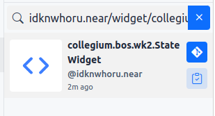
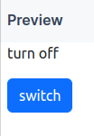

# Collegium-BOS-WK2

## 주제: 위젯을 좀 더 인터렉티브하게 만들기

## 1. 온라인 에디터 환경 접속하기
1. [nearpad 편집기](https://nearpad.dev/editor) 사이트에 접속해주세요.

## 2. State를 이용하여 UI에 변경을 발생시키기
1. `idknwhoru.near/widget/collegium.bos.wk2.StateWidget` 위젯을 Fork 해주세요.

2. switch 버튼을 클릭했을 때 turn off 메시지가 변경되는 것을 확인해주세요.

## 3. Web3 지갑 연결하기
1. 

## 4. Ethereum 컨트랙트 사용하기

## 5. LiquityWidget 사용하기

## Mission
`LiquityOpenTrove` 위젯에 몇가지 추가 요청 사항이 들어왔습니다.
요청 사항은 다음과 같습니다. 
- [ ] `openTrove`가 성공한 지갑은 `closeTrove`가 실행되기 전까지 `이 지갑은 이미 활성화된 트로브가 있습니다.` 메세지를 표시해주세요.
- [ ] `borrowWrapper` 컴포넌트의 스타일을 외부 css파일을 불러와서 적용해보세요.
    - hint 1: fetch API를 사용하세요.
    - hint 2: 이 주소에서 불러와주세요.
- [ ] `openTrove` 기능의 가스 비용을 최적화 하기 위해 NICR이라는 값을 계산해야 합니다. openTrove 함수에 NICR을 계산하는 기능을 추가해주세요.
    - NICR = Ether / LUSD * 100
    - hint 1: `ethers.js` api 기능을 사용해서 계산해주세요